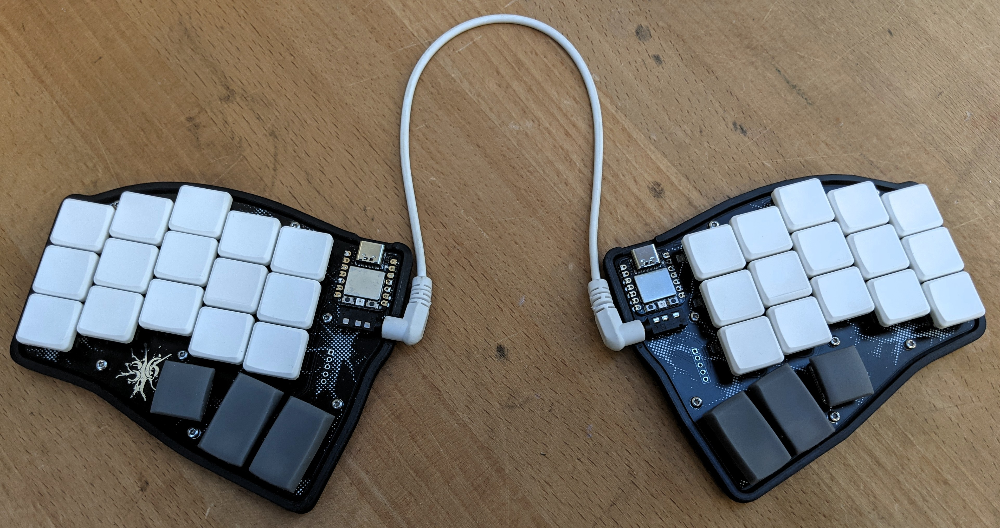

# neuro36

- 36 key
- reversible PCB
- Xiao Seed RP2040 mcu
- choc-spaced
- remaining pins broken out on right hand  
  (hope was to add trackball)
- low profile printed case
- press fit travel protector
- silkscreen of real neurons  
  (EM image taken by my partner)
- hotswap or soldered mount of main 30 keys
- thumb keys can be soldered in either orientation

## Goals

I wanted a keyboard I could travel with. I need 36 keys and like to have larger keys to rest my thumbs on (probably due my journy having been Ergodox -> gergo).

I wanted to learn KiCAD and thanks to all the amazing open source keyboards out there it was a breeze.

## Making one

The [jlcpcb folder](/jlcpcb/) is what I sent off for manufacturing.
Five PCBs (enough for two keyboards) cost me 14.22 GBP incl. shipping and taxes.

The case is printable without supports, the travel protector needs supports. Make sure you have good bed adhesion and a warped print will give you a wobbly case.

Apart from the PCBs you will need:

- 36 choc switches
- keycaps (my thumbs are: [1u chicago steno](https://www.printables.com/model/158865-chicago-steno-low-profile-keycaps-kailh-choc/files#preview:file-oSJYS) and [1.5u chicago steno](https://www.printables.com/model/235527-thumb-15u-90deg-rotated-stem-fixed#preview:file-UjejR))
- TRRS cable
- heat press inserts (M2(ID) x 3.2mm(OD))
- screws (M2 x 5)
- TRRS jacks THT
- 1N4148WS SOD-323

I picked a very small diode footprint by accident. I'd suggest going for something larger if you are up for tweaking the KiCAD project.

## Firmware

You can use my [unmerged QMK branch](https://github.com/erkannt/qmk_firmware/tree/neuro36/keyboards/neuro36) for this keyboard.

Someday I might try to get this merged.

Here is my current keymap.

